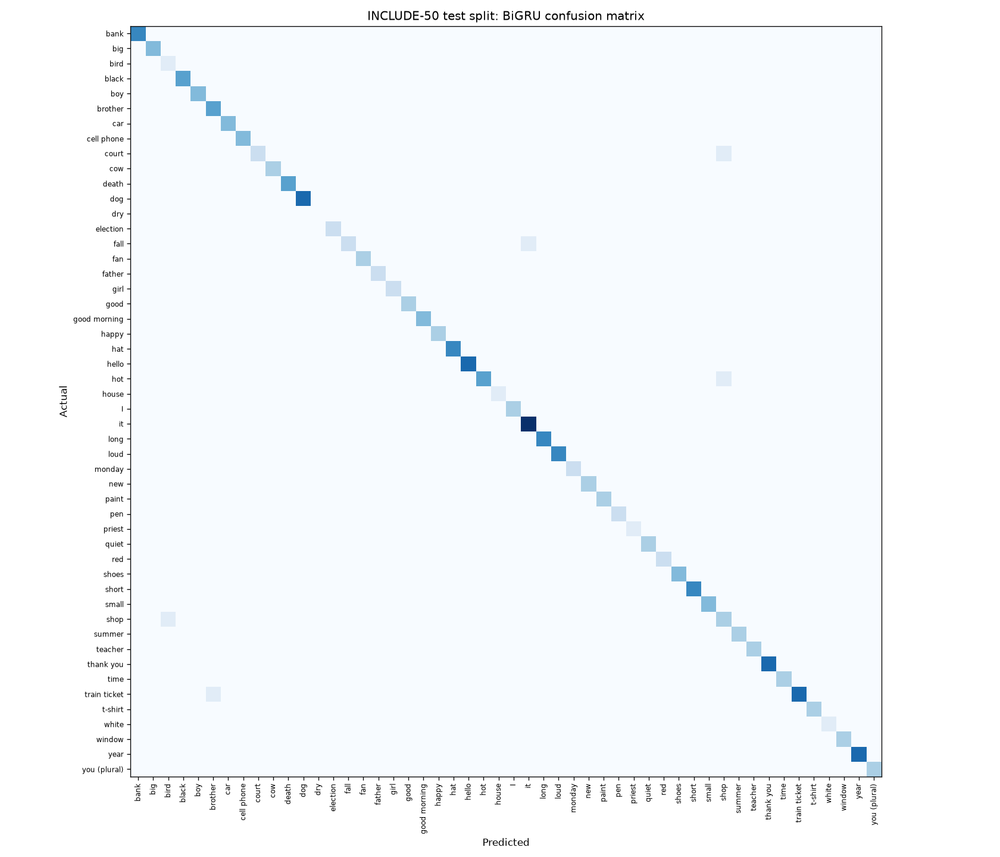

# ISL Sign Language Interpreter

Recognises **Indian Sign Language (ISL) word signs** from a webcam, turns them into a natural sentence with an LLM on
[Groq](https://groq.com/), and speaks it out loud, so a deaf or hard-of-hearing signer can talk to a hearing person.

- **Vocabulary:** the 50 words of the INCLUDE-50 benchmark (hello, thank you, good morning, I, you (plural), happy,
  teacher, father, brother, time, Monday, ...).
- **How it works:** MediaPipe tracks the hands and upper body → body-normalised landmark sequences → a bidirectional
  GRU classifies each sign → a Groq LLM phrases the sentence → text-to-speech.
- **Everything is reproducible:** scripts download the dataset, extract landmarks, train and evaluate.

## Results

Official INCLUDE-50 test split: 192 videos (trained on 689, validated on 77).

| Model | Top-1 | Top-3 | Macro-F1 |
|---|---|---|---|
| Baseline: logistic regression on summary features (deterministic) | 94.3% | 97.9% | 0.934 |
| BiGRU on landmark sequences, mean ± std over 5 training runs | 95.5% ± 0.8 | 99.0% ± 0.5 | 0.953 ± 0.008 |
| **BiGRU, saved model** (best validation accuracy of the 5 runs) | **96.4%** | 98.4% | 0.962 |
| INCLUDE paper, best model on INCLUDE-50 | 94.5% | – | – |

Averaged over 5 runs, the BiGRU scores +1.3 points top-1 against the baseline (run-to-run standard deviation 0.8 points).

BiGRU inference: 4.7 ms per sign on CPU. Hardest words for the saved model: girl (50%), court (67%), fall (67%), boy (75%), hot (83%).

INCLUDE's 7 signers appear in every split, so these are *seen-signer* results. Accuracy for a new signer and camera will be lower.

**Live path:** replaying the 192 test videos through the app's own segmenter and model gives **93.2%** top-1. 6 videos never started a sign and 0 were split into several. The gap to the offline number is the segmenter: MediaPipe sometimes loses a fast-moving hand for most of a sign, and a few words are signed low. Words that start a sign in under 80% of their videos: priest (20%), fall (60%), shop (64%).



## How to use it

1. Sign a word, then lower your hands. The word appears at the bottom (`Signed:`).
2. Sign more words the same way.
3. Keep your hands down for 2 seconds. The ring fills up, the sentence is sent, and the bot says it out loud (`Said:`).

**Backspace** removes the last word; **Esc** or closing the window quits. Sit so your shoulders are in view.
Words the model isn't sure about show as "? maybe: ..." and aren't added.

To learn how a word is signed, play its reference video: `python -m isl.examples thank you`
(`python -m isl.examples` lists them).

## Setup (Windows)

Requires **Python 3.10 – 3.12**.

```bash
py -3.12 -m venv .venv
.venv\Scripts\activate
pip install -r requirements.txt
```

Copy `.env.example` to `.env` and paste your free key from https://console.groq.com/keys. The MediaPipe models
(14 MB) download automatically the first time you run the app.

```bash
python signlan.py
```

The trained model is in `models/`, so the app works without the dataset. Step-by-step testing: [TESTING.md](TESTING.md).

## Reproducing the model

```bash
python scripts/prepare_include50.py   # ~15 GB streamed from Zenodo, ~1-2 hours; safe to stop and re-run
python scripts/train.py               # ~5-10 minutes on CPU; writes models/ and reports/
python scripts/evaluate_live.py       # replays the videos through the live app's segmenter: reports/live_path.md
```

`prepare_include50.py` reads only the 958 INCLUDE-50 videos out of the 57 GB dataset. It uses HTTP range requests
to fetch single files from inside the Zenodo zips (8 at a time, since Zenodo limits each connection to about
0.3 MB/s), turns each video into landmarks, then deletes it.

`train.py` trains the baseline once (it's deterministic) and the BiGRU with 5 random seeds (`--seeds N`), reports the
mean and spread, and saves the run with the best **validation** accuracy. The test split is only used for reporting.

## Project layout

| Path | Purpose |
|---|---|
| `signlan.py` | Live app: webcam → landmarks → segmenter → model → sentence → Groq → speech |
| `isl/features.py` | Landmarks → 184 body-normalised numbers per frame (shared by training and the app) |
| `isl/landmarks.py` | MediaPipe hand + pose tracking |
| `isl/segmenter.py` | Cuts the live stream into single signs (hands up → sign → hands down) |
| `isl/model.py` | The BiGRU: build, save, load, predict |
| `isl/augment.py` | Training-time variations (flip, rotate, scale, speed, noise) |
| `isl/include_data.py` | INCLUDE-50 splits and labels; range-fetching videos from Zenodo |
| `scripts/` | Dataset preparation, training, and live-path evaluation |
| `reports/` | Measured results and confusion matrix |
| `tests/` | Unit, smoke and end-to-end tests: `python -m unittest discover -s tests -t . -v` |

## Limitations

- INCLUDE has 7 signers, and the same people appear in every split. The results above measure *seen signers*, so
  expect lower accuracy for a new signer, camera and room.
- Only the 50 INCLUDE-50 words are recognised. The pipeline supports the full 263-word INCLUDE set with a split
  change, but that hasn't been trained or evaluated.
- One sign at a time: lower your hands between signs. A sign ends 0.3 s after your hands drop below waist height,
  or 0.8 s after they leave the camera's view (MediaPipe briefly loses fast-moving hands, so short gaps are
  bridged).
- Priest, fall and shop often don't start a sign in the live app (see the live-path results above).
- The saved model's 7 test mistakes: boy ↔ girl (both ways), court → shop, hot → shop, dog → long, fall → it,
  train ticket → teacher. A simple baseline already reaches 94.3%, so most of the accuracy comes from the
  body-normalised landmark features; the BiGRU adds about 1.3 points on average.

## Credits

Dataset: **INCLUDE** by A. Sridhar, R. G. Ganesan, P. Kumar and M. Khapra, "INCLUDE: A Large Scale Dataset for
Indian Sign Language Recognition", ACM Multimedia 2020. Videos under CC-BY-4.0 from
[Zenodo record 4010759](https://zenodo.org/record/4010759); split lists from
[AI4Bharat/INCLUDE](https://github.com/AI4Bharat/INCLUDE) (MIT), see `isl/include50/SOURCE.md`.
Hand and pose tracking: [MediaPipe](https://ai.google.dev/edge/mediapipe).
